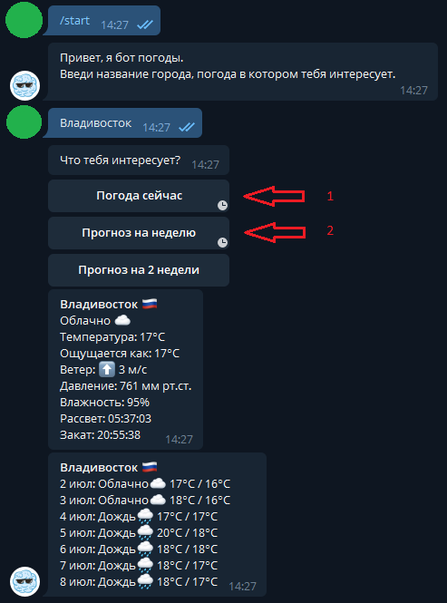

# Weatherbot
## Телеграм бот погоды. Выдает информацию о текущей погоде и прогноз до 14 дней
##### Java 15 + Spring boot 2 + Maven

Выдает текущую погоду или прогноз по названию города от пользователя

Использует Telegram Bot Api и openweather.api

##### Пример работы:

##### Для запуска:
1) Зарегистрировать бота с помощью BotFather: https://core.telegram.org/bots

2) Полученные токен и юзернейм записать как **telegram.bot.token** и **telegram.bot.username**
в файл *main/resources/application.properties* или задать как параметры запуска приложения 

3) Зарегистрироваться на https://openweathermap.org/api

4) Полученный ключ также записать в параметры как **openweather.api.key**

5) Запустить **WeatherbotApplication.java**

6) Для тестирования занести те же параметры в *test/resources/test.properties*